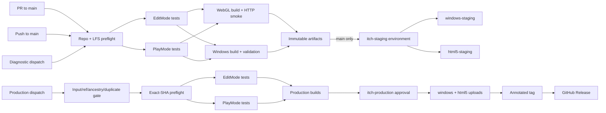

# Unity CI/CD and release operations

## Overview

This repository pins Unity `6000.3.19f1` and builds the enabled scenes from Unity Build Settings. CI never changes the project Unity version, product identity, rendering, input, scene content, or WebGL compression. The system uses GameCI for licensed Unity execution, immutable GitHub artifacts between jobs, and itch.io's stable Butler CLI for uploads.

> CI is not fully operational until a licensed Unity run and a real Butler staging upload succeed. Structural checks do not prove gameplay correctness.

## Trigger and dependency matrix

| Trigger | Validation/tests | Builds | itch | GitHub Release |
|---|---|---|---|---|
| PR targeting `main` | Repository/LFS, compilation, EditMode, PlayMode | WebGL structural/loading smoke | Never; no itch environment or credentials | No |
| Push to `main` | Same | Windows 64-bit + WebGL | `windows-staging`, `html5-staging` after every prerequisite passes | No |
| Manual diagnostic | Same | WebGL, optionally Windows | Never | No |
| Manual production | Early input/ref gate, then all checks again at resolved SHA | Windows + WebGL | Protected `windows`, `html5` | Annotated tag and release after both uploads succeed |

The reusable workflow orders `preflight -> EditMode and PlayMode in parallel -> target builds in parallel`. Deployment jobs download those exact artifacts and never rebuild. PR workflows use `pull_request`, never `pull_request_target`, have read-only permissions, and never reference itch secrets. Fork PRs are safe, but GitHub withholds Unity repository secrets from forks; such runs fail with an actionable licensing message rather than executing untrusted code with secrets. A maintainer must inspect the fork and test it from a trusted branch.

## Files and responsibilities

| File | Purpose |
|---|---|
| `.github/workflows/unity-ci.yml` | PR, `main`, and diagnostic policy; staging deploy |
| `.github/workflows/unity-release.yml` | Manual production gate, protected deploy, tag, release |
| `.github/workflows/_unity-build.yml` | Reusable LFS/test/build/package/artifact implementation |
| `Assets/Editor/CI/CIBuild.cs` | Exact-version, enabled-scene and target preflight; strict non-development builds |
| `scripts/ci/repository-preflight.sh` | Repository, Unity version, generated-output, and LFS checks |
| `scripts/ci/validate-lfs.sh` | Detect unresolved LFS pointer content under `Assets/` |
| `scripts/ci/validate-output.sh`, `validate-webgl.py` | Target structure and WebGL reference/case checks |
| `scripts/ci/webgl-smoke.sh` | Local HTTP 200 checks for index and key resources |
| `scripts/ci/package-build.sh` | Root-correct ZIP creation and integrity checks |
| `scripts/ci/generate-manifest.sh` | UTC traceability, sizes, and SHA-256 metadata |
| `scripts/ci/install-butler.sh`, `deploy-itch.sh` | Stable official Butler installation and guarded push |
| `.github/dependabot.yml` | Monthly, non-auto-merged GitHub Actions update PRs |

New files under `Assets/` have committed `.meta` files. CI-only scripts remain outside `Assets/`.

## Artifacts, build identity, and caches

Staging versions use the Unity `PlayerSettings.bundleVersion` base, currently `0.1.0`, producing `0.1.0-staging.<run-number>+<short-sha>`. Production uses the dispatch version exactly. Build manifests record repository, product, exact Unity version, platform, version/type, ref, full/short SHA, run ID/attempt, UTC time, development flag, filename, sizes, and SHA-256.

Artifacts are named `unity-editmode-<sha>`, `unity-playmode-<sha>`, `unity-build-windows-<sha>`, `unity-build-webgl-<sha>`, and per-target log artifacts. PR retention is 7 days, diagnostics 14, `main` staging 21, and production 30. Production release assets are `project-gmtk-2026-windows-v<version>.zip`, `project-gmtk-2026-webgl-v<version>.zip`, `build-manifest-v<version>.json`, and `SHA256SUMS-v<version>.txt`.

Windows ZIP contents are at the archive root: the `.exe`, matching `_Data`, runtime DLLs, and other player files. WebGL ZIP has root `index.html`, `Build/`, and optional `TemplateData/`/`StreamingAssets/`. Debug/backup folders are rejected. Windows checks are structural only; they do not launch the game.

Library caches are isolated by OS, exact Unity version, target/test mode, package manifests, project settings, assembly definitions, and C# source. Windows and WebGL never share a writable key. To force reimport, delete matching caches under **Actions -> Caches**, or make a relevant dependency/settings change. Do not upload `Library` as an artifact.

Download artifacts from **GitHub -> Actions -> workflow run -> Artifacts**. Required payloads use `if-no-files-found: error`; Unity/test logs upload with `always()` where available.

## One-time GitHub setup

Create these environments in **Repository Settings -> Environments**:

1. `itch-staging`: no approval; restrict deployment branches to `main` where the plan supports it.
2. `itch-production`: add required reviewers, prevent self-review when team size/plan permits, and restrict to `main` or intentional protected release refs. Workflow YAML cannot create these rules.

Configure both environments consistently:

| Name | Kind | Value |
|---|---|---|
| `BUTLER_API_KEY` | Environment secret | itch API key; never print it |
| `ITCH_PROJECT` | Environment variable | `username/project-slug`, e.g. `alegruz/project-gmtk-2026` |
| `ITCH_GAME_URL` | Optional environment variable | Human-facing project URL for operators |

Configure Unity credentials as repository secrets (or an appropriate trusted environment accessible to all Unity jobs):

| Secret | Unity Personal | Unity Pro |
|---|---|---|
| `UNITY_LICENSE` | Required activation/license content | Optional when serial activation is used |
| `UNITY_EMAIL` | Required | Required |
| `UNITY_PASSWORD` | Required | Required |
| `UNITY_SERIAL` | Not used | Required instead of `UNITY_LICENSE` for eligible Pro serial activation |

Follow GameCI's license activation procedure and paste secret values only in GitHub Settings. Never commit licenses or credentials. Fork PRs cannot receive these secrets. Protect `main` and require the CI checks after their first successful appearance.

If the itch username or project slug changes, update `ITCH_PROJECT` in both environments. No YAML change is needed. If the GitHub repository name changes, update the README badge URL; manifests use `GITHUB_REPOSITORY` automatically.

## One-time itch.io setup

Butler uploads cannot create the project page. Create the project in itch.io, set its kind/platform metadata, and ensure the account owning the API key can edit it. After initial uploads:

- Configure the production `html5` upload as **This file will be played in the browser** and verify embedding/fullscreen.
- Mark production Windows with the Windows platform.
- Distinguish or hide the `windows-staging` and `html5-staging` uploads in the project editor. Channel names alone do not make uploads private.
- A single itch project may show `html5-staging` as another upload without a convenient separate embedded browser page.

CI uploading to itch and submitting to GMTK are separate operations. Attach this exact itch project to the GMTK jam submission manually and verify it before the deadline.

## Operating releases

For staging, merge or push to `main`; a newer run cancels an obsolete same-branch CI/staging run. Both staging channels must pass. For production, open **Actions -> Unity production release -> Run workflow**, enter strict `major.minor.patch` without `v`, choose a ref (default `main`), choose `candidate` or `final`, and type `RELEASE` exactly. Candidate releases become GitHub prereleases.

The gate rejects unsafe/unresolved refs, commits not reachable from `main`, and existing tags/releases before Unity work. The resolved SHA is rebuilt. Production requests serialize and are never canceled. Approval of `itch-production` gates both production uploads and publication. After Windows and WebGL itch pushes succeed, CI rechecks uniqueness, creates annotated `v<version>` without force, then publishes GitHub Release assets. A failed itch upload therefore cannot produce a success-claiming Release. If tagging succeeds but `gh release create` fails, the immutable tag remains; investigate and publish the release manually from the verified run assets rather than moving/deleting the tag.

## Verification and routine troubleshooting

- **Rerun:** open the failed run, inspect the first failed prerequisite, then use **Re-run failed jobs**. Do not repeatedly approve production until the cause is understood.
- **Unity licensing:** missing-secret errors occur before Unity. Activation failures appear in Unity logs. Confirm all Personal secrets, line-preserving license content, account access, and seat availability; for Pro also confirm `UNITY_SERIAL`. Never paste secrets into an issue.
- **Missing LFS:** `git lfs pull` or pointer-scan failures mean storage/quota/object availability or LFS tracking is broken. Run `git lfs fetch --all`, confirm the object exists at the remote, then retry. Do not replace it with pointer text.
- **WebGL structure:** missing loader/data/WASM, bad HTML references, wrong path case, or HTTP non-200 fails the smoke check. Compare `index.html`/loader configuration to emitted files. Compression remains the repository setting (`webGLCompressionFormat: 0`); CI does not casually change it.
- **Butler:** authentication errors mean the environment key lacks access or expired. Slug errors mean `ITCH_PROJECT` is absent/malformed or the page does not exist. Check `username/project-slug`, not the page URL. The job summary records Butler version, destination, version, SHA, and run without the key.
- **No tests:** zero discovered tests is explicitly not gameplay coverage. Add meaningful project tests later; CI does not fabricate gameplay assertions.

Verify hosted output, not only CI output: open itch WebGL in an incognito window and check network/loading. Download Windows from the itch page, extract into a clean directory, and run on Windows without Unity installed. This is the exact user delivery path.

## Rollback and emergency fallback

Rollback by starting a new production dispatch with a new semantic patch version and a known-good tag/commit that is reachable from `main`. Rebuild and redeploy it; never force-move or overwrite an existing release tag. Because itch channels point to their latest pushed build, the known-good rebuild becomes current while the audit trail remains intact.

If GitHub Actions is unavailable near the deadline, use Unity `6000.3.19f1` locally, switch/install the exact Windows and WebGL modules, build enabled Build Settings scenes as non-development players, run the scripts here to validate/package, install stable Butler, and push the build directories to the same channels. Record the source SHA and checksums manually. Do not use another Unity patch. Manually create an annotated unused version tag and GitHub Release only after both itch uploads are verified.

## Final GMTK deadline checklist

- [ ] Freeze risky changes before the deadline.
- [ ] Trigger a production candidate and approve `itch-production`.
- [ ] Confirm both itch uploads succeeded.
- [ ] Open WebGL from itch in an incognito browser.
- [ ] Test loading, input, audio, scene transitions, restart, and fullscreen.
- [ ] Download Windows from itch, not a local build folder.
- [ ] Extract into a clean directory and launch on Windows without Unity Editor.
- [ ] Test keyboard and mouse; check antivirus and missing-DLL behavior.
- [ ] Confirm version and source SHA in the build manifest.
- [ ] Confirm itch cover, screenshots, description, credits, controls, metadata, and platform labels.
- [ ] Confirm the project is actually submitted to GMTK and the correct project is attached.
- [ ] Confirm submission visibility from another browser session.
- [ ] Stop unnecessary production deployments after the deadline.
- [ ] Preserve the final annotated tag and GitHub Release.

Automated checks validate compilation, test execution, package structure, references, and basic HTTP loading only. They do not establish gameplay, input feel, audio, browser compatibility, antivirus reputation, performance, or jam-submission correctness; retain human final QA.
